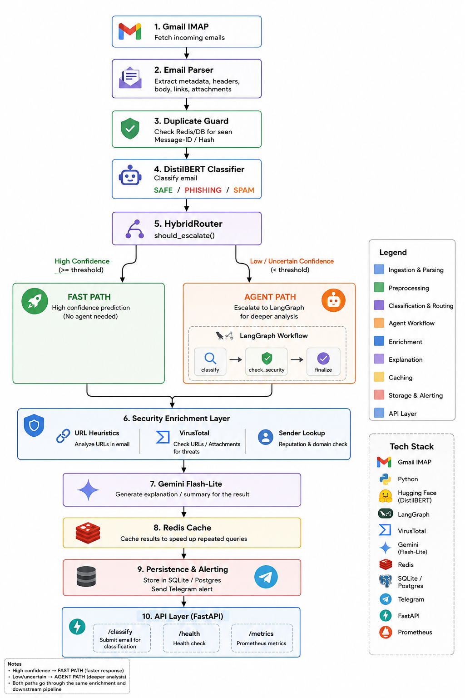
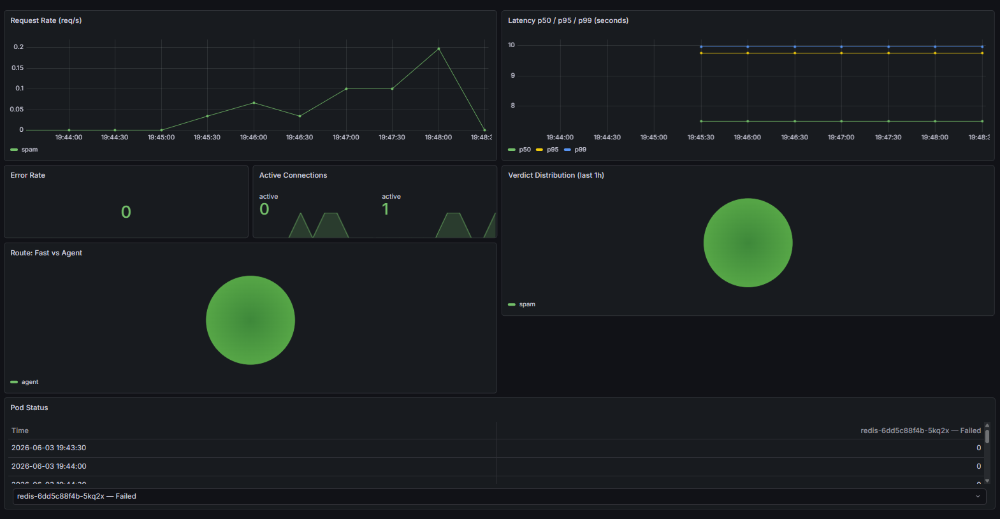

# Spam Mail Agent

Production-grade email spam/phishing detection với hybrid ML + agentic architecture, deployed trên Kubernetes với GitOps workflow.

[](https://github.com/kubbies03/spam-mail-agent/actions/workflows/ci.yml)



---

## Grafana Dashboard



---

## Architecture

```
Gmail IMAP
     │
     ▼
Email Parser → Duplicate Guard → DistilBERT Classifier (safe/phishing/spam)
                                          │
                                          ▼
                                 HybridRouter.should_escalate()
                                  /                        \
                            FAST PATH                 AGENT PATH
                         (high confidence)          (LangGraph)
                                  \               classify → check_security → finalize
                                   \                        /
                              URL heuristics + VirusTotal + sender lookup
                                          │
                                          ▼
                             Gemini Flash-Lite explanation + Redis cache
                                          │
                                          ▼
                         SQLite/Postgres + Telegram alert
                                          │
                                          ▼
                          FastAPI /classify /health /metrics
```

### Routing logic

| Điều kiện | Kết quả |
|---|---|
| Classifier confidence < 0.82 | → Agent path |
| URL suspicious | → Agent path |
| Unknown sender domain | → Agent path |
| Phishing prob ≥ 0.50 | → Agent path |
| Spam prob ≥ 0.65 | → Agent path |
| ≥ 3 keyword signals | → Agent path |
| Còn lại | → Fast path |

### LangGraph agent (3 nodes)

```
classify → check_security → finalize
```

- **classify**: DistilBERT 3-class prediction
- **check_security**: URL heuristics + VirusTotal + WHOIS sender age
- **finalize**: risk aggregation, verdict determination

---

## GitOps Deployment

```
git push main
  → GitHub Actions: test → build Docker image → push Docker Hub
  → CI update k8s/deployment.yaml image tag
  → ArgoCD detect change → sync lên k3s cluster
  → Rolling update (zero downtime)
  → Prometheus scrape /metrics → Grafana dashboard
```

### Tech stack

| Layer | Technology |
|---|---|
| App | FastAPI, DistilBERT, LangGraph, Gmail IMAP |
| Container | Docker, Docker Hub |
| CI | GitHub Actions |
| Orchestration | k3s (Kubernetes) |
| GitOps | ArgoCD |
| Ingress | Nginx Ingress Controller |
| Monitoring | Prometheus, Grafana |

---

## Project Structure

```
spam-mail-agent/
├── app/
│   └── main.py              # FastAPI: /classify /health /metrics /analytics
├── src/
│   ├── pipeline.py          # Orchestrator (APScheduler + semaphore)
│   ├── router.py            # HybridRouter: fast vs agent path
│   ├── agent.py             # LangGraph StateGraph (3 nodes)
│   ├── classifier.py        # DistilBERT (primary) + SVM/TF-IDF (fallback)
│   ├── security.py          # URL heuristics, VirusTotal, sender lookup
│   ├── explainer.py         # Gemini Flash-Lite + Redis cache
│   ├── db.py                # SQLAlchemy 2.0, auto-migrate
│   ├── schemas.py           # Pydantic contracts
│   ├── email_fetcher.py     # Gmail IMAP + RFC822 parser
│   ├── telegram_bot.py      # Alerts + feedback buttons
│   ├── config.py            # Pydantic Settings từ .env
│   └── monitoring.py        # In-memory metrics + latency timer
├── k8s/
│   ├── namespace.yaml
│   ├── configmap.yaml
│   ├── pvc.yaml
│   ├── deployment.yaml      # api (2 replicas) + poller (1) + redis
│   ├── service.yaml
│   ├── ingress.yaml
│   └── monitoring/
│       ├── servicemonitor.yaml    # Prometheus scrape config
│       └── grafana-dashboard.yaml # Grafana dashboard
├── .github/workflows/
│   └── ci.yml               # GitHub Actions CI/CD
├── argocd-app.yaml          # ArgoCD Application
├── tests/                   # pytest (49 tests)
├── scripts/                 # Training scripts
├── models/                  # distilbert_multilingual/ + svm_tfidf.joblib
├── Dockerfile               # Multi-stage build
├── docker-compose.yml       # Local dev
└── requirements.txt
```

---

## API Endpoints

| Method | Path | Mô tả |
|---|---|---|
| `POST` | `/classify` | Phân loại email, trả về verdict + risk score |
| `GET` | `/health` | Liveness/readiness probe |
| `GET` | `/metrics` | Prometheus metrics |
| `GET` | `/analytics` | Thống kê từ database |

### Ví dụ classify

```bash
curl -X POST http://<HOST>/classify \
  -H "Content-Type: application/json" \
  -d '{
    "sender": "promo@deals-winner2026.top",
    "subject": "You won $1000!",
    "body": "Click here: http://bit.ly/win-free-2026"
  }'
```

```json
{
  "verdict": "spam",
  "risk_score": 0.8829,
  "route": "agent",
  "confidence": 0.8329,
  "signals": ["financial lure", "url present"],
  "recommended_action": "block_or_quarantine",
  "agent_backend": "langgraph",
  "latency_ms": 9420
}
```

---

## Local Development

```bash
python -m venv .venv
.venv\Scripts\activate        # Windows
source .venv/bin/activate     # Linux/macOS

pip install -r requirements.txt
cp .env.example .env          # điền credentials

# Chạy API server
uvicorn app.main:app --reload --port 8000

# Hoặc Docker Compose
docker compose up --build

# CLI commands
python main.py classify-text --text "urgent verify password"
python main.py classify-raw --path data/test_spam.eml
python main.py poll-once
python main.py run            # continuous polling
python main.py analytics

# Tests
pytest                        # all 49 tests
pytest tests/test_classifier.py
```

---

## Environment Variables

| Variable | Default | Mô tả |
|---|---|---|
| `GMAIL_USER` | — | Gmail address |
| `GMAIL_APP_PASSWORD` | — | Gmail App Password |
| `GMAIL_FOLDERS` | `INBOX,[Gmail]/Spam` | Mailboxes to poll |
| `DATABASE_URL` | `sqlite:///data/spam_agent.db` | SQLite hoặc Postgres |
| `REDIS_URL` | `redis://localhost:6379/0` | Redis cache |
| `TELEGRAM_BOT_TOKEN` | — | Telegram bot token |
| `TELEGRAM_CHAT_ID` | — | Telegram chat ID |
| `GOOGLE_API_KEY` | — | Gemini API key |
| `GEMINI_MODEL` | `gemini-2.5-flash-lite` | Gemini model |
| `VIRUSTOTAL_API_KEY` | — | VirusTotal API key |
| `CLASSIFIER_THRESHOLD` | `0.82` | Confidence tối thiểu để đi fast path |
| `PHISHING_ESCALATION_THRESHOLD` | `0.50` | Ngưỡng escalate phishing |
| `SPAM_ESCALATION_THRESHOLD` | `0.65` | Ngưỡng escalate spam |

Tất cả integrations (Gemini, VirusTotal, Telegram, Redis) đều optional — app tự fallback khi thiếu credentials.

---

## Training

```bash
# Fine-tune DistilBERT
python scripts/train_distilbert.py --csv data/spam_dataset.csv --epochs 2 --batch-size 8

# SVM + TF-IDF fallback
python scripts/train.py --csv data/spam_dataset.csv

# ONNX export
python scripts/export_onnx.py --model-dir models/distilbert_multilingual
```

---

## Security

- **Prompt injection**: Gemini nhận email content như opaque data, tách biệt `system_instruction`. Body truncate ≤ 1000 chars, subject ≤ 512 chars.
- **URL analysis**: IP host, URL shortener, TLD blocklist, brand impersonation, non-HTTPS, VirusTotal (max 8 URLs, cooldown 15 phút khi 429).
- **Sender analysis**: Trusted domain whitelist, known notification domains, WHOIS domain age.

---

## Troubleshooting

| Triệu chứng | Xử lý |
|---|---|
| Pod `CrashLoopBackOff` | `kubectl logs -n spam-agent <pod>` xem lỗi |
| ArgoCD `OutOfSync` | `kubectl patch application spam-agent -n argocd --type merge -p '{"operation":{"sync":{"revision":"HEAD"}}}'` |
| `/health` trả 503 | Đợi 60s (model loading), xem log |
| Gmail không có email | Bật IMAP trong Gmail settings, dùng App Password |
| Redis unavailable | App vẫn chạy, LLM cache bị tắt |
| Gemini rate-limited | Fallback heuristics chạy, cooldown 15 phút |
